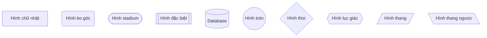

```mermaid 
graph TD 
    A[Hình chữ nhật] 
    B(Hình bo góc) 
    C([Hình stadium]) 
    D[[Hình đặc biệt]] 
    E[(Database)] 
    F((Hình tròn)) 
    G{Hình thoi} 
    H{{Hình lục giác}} 
    I[/Hình thang/] 
    J[\Hình thang ngược\] 
```
